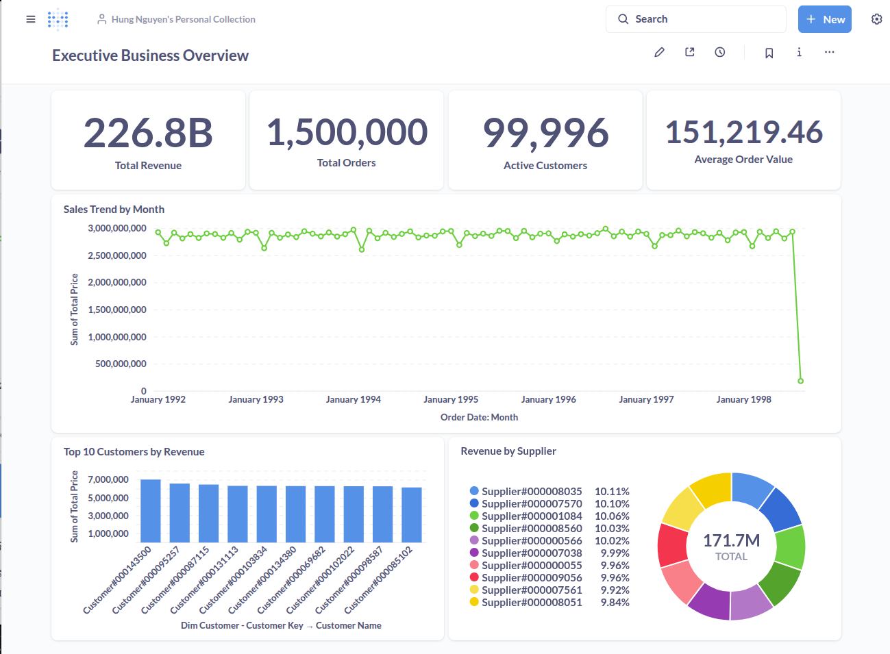
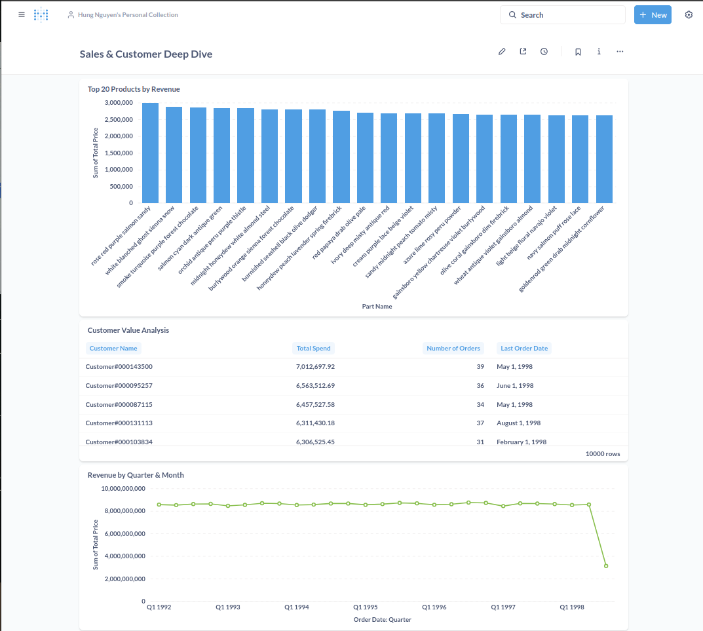
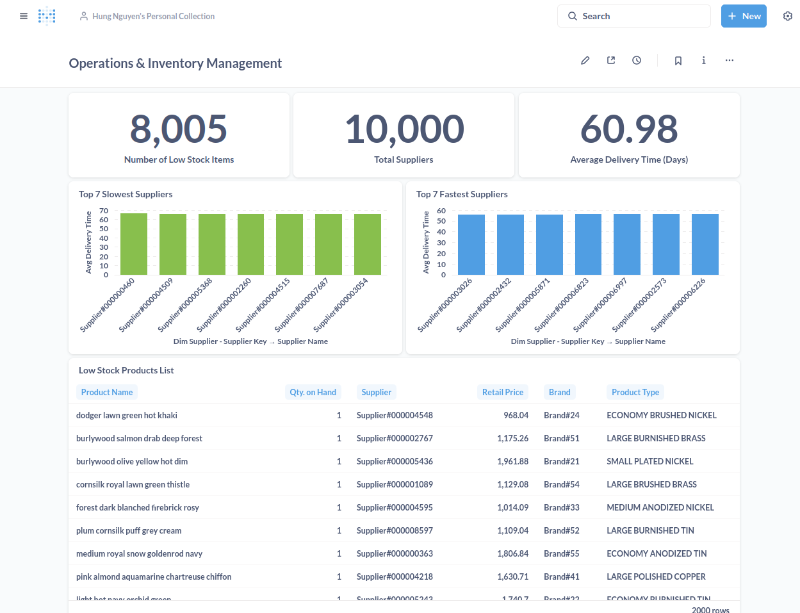

# TPC-H Data Warehouse

> Modern data warehouse pipeline with medallion architecture using the [TPC-H benchmark dataset on Snowflake](https://docs.snowflake.com/en/user-guide/sample-data-tpch).

## Architecture
### Pipeline Overview


### Data Warehouse Schema


## Dashboards

### 1. Executive Business Overview

This dashboard provides a high-level overview of core business metrics, intended for management and executive-level stakeholders.



### 2. Sales & Customer Deep Dive
This dashboard provides a deep dive into revenue by product, the purchasing behavior of top customers, and revenue trends over time.



### 3. Operations & Inventory Management
This dashboard focuses on operational efficiency, tracking key inventory metrics, supplier performance, and delivery times.



## Quick Start

```bash
# Clone and setup
git clone git@github.com:hungfnguyen/tcph-data-warehouse.git
cd tcph-data-warehouse
cp .env.example .env

# Start infrastructure
docker-compose up -d

# Run pipeline
make run-pipeline
```

## Features

- **ELT Pipeline**: Snowflake TPC-H → Data Lake → Data Warehouse
- **Medallion Architecture**: Bronze (raw) → Silver (cleaned) → Gold (analytics)
- **Automated Orchestration**: Airflow DAGs with error handling
- **Data Quality**: Built-in validation and monitoring
- **Business Intelligence**: Interactive dashboards and KPIs

## Components

| Component | Purpose | URL |
|-----------|---------|-----|
| Airflow | Orchestration | http://localhost:8080 |
| MinIO | Object Storage | http://localhost:9001 |
| PostgreSQL | Data Warehouse | localhost:5432 |
| Metabase | Analytics | http://localhost:3000 |

## Key Metrics

- **8 source tables** → **3 fact tables + 4 dimensions**
- **6M+ records** processed through medallion layers
- **Sub-second query performance** on star schema
- **99%+ data quality** score with automated validation

## Project Goals

Learning modern data engineering practices including:
- Cloud data extraction and processing
- ELT vs ETL methodologies  
- Dimensional modeling and star schemas
- Data quality and pipeline monitoring
- Business intelligence and analytics

---

## Authors

- **Hung Nguyen** – [@hungfnguyen](https://github.com/hungfnguyen)
